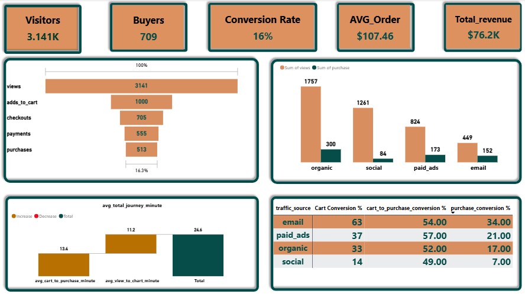

# 🛒 E-Commerce User Behavior & Conversion Funnel Analysis

##  Project Overview
This project is an end-to-end Data Analytics and Business Intelligence solution focused on analyzing user behavior within an e-commerce platform. The primary objective is to map the user journey, identify bottlenecks in the sales funnel, and evaluate the performance of various marketing traffic sources.

By leveraging **Google BigQuery** for complex data extraction and **Power BI** for interactive data visualization, this project transforms raw event logs into actionable business insights.

---

##  Tools & Technologies
- **SQL Dialect:** Google Standard SQL (BigQuery)
- **Data Visualization:** Power BI
- **Techniques Used:** Common Table Expressions (CTEs), Aggregations, Date/Time Functions, Safe Division, Conditional Formatting, Cross-filtering.

---

##  Repository Structure
The SQL queries are modularized into 5 distinct files, each focusing on a specific business metric:

1. [`01_funnel_stages_count.sql`](Ecommerce-Funnel-Analysis/SQL_Queries/funnel_stages_count.sql): Extracts the raw unique user counts for each stage (View, Cart, Checkout, Payment, Purchase).
2. [`02_funnel_conversion_rates.sql`](Ecommerce-Funnel-Analysis/SQL_Queries/funnel_conversion_rates.sql): Calculates step-by-step drop-off percentages and the overall conversion rate.
3. [`03_traffic_source_performance.sql`](Ecommerce-Funnel-Analysis/SQL_Queries/traffic_source_performance.sql): Evaluates marketing channels based on user acquisition and purchase conversion quality.
4. [`04_time_to_conversion.sql`](Ecommerce-Funnel-Analysis/SQL_Queries/time_to_conversion.sql): Analyzes the average time users take to navigate from landing to final purchase.
5. [`05_revenue_and_aov_analysis.sql`](Ecommerce-Funnel-Analysis/SQL_Queries/revenue_and_aov_analysis.sql):Connects user behavior to financial metrics like Total Revenue and Average Order Value (AOV).
---

##  Key Business Insights

### 1. The Funnel Bottleneck
- The overall conversion rate stands at **16.3%**.
- **Major Drop-off:** The most significant loss of potential customers occurs between the *Product View* (3.141K users) and *Add to Cart* (1.34K users) stages. This indicates a strong need for Product Page Optimization or A/B testing on call-to-action buttons.

### 2. Traffic Source Efficiency
- While Organic search drives the highest volume of traffic, **Email Campaigns** yield the highest quality of leads, boasting a remarkable **34% purchase conversion rate**.
- *Recommendation:* Reallocate marketing budget to intensify email retargeting campaigns for cart abandoners.

### 3. User Journey & Time
- The average user journey from initial view to final purchase takes **25 minutes**.
- A noticeable delay occurs between the Cart and Purchase stages (approx. 13 minutes), suggesting friction in the checkout or payment process that requires UX refinement.

### 4. Financial KPIs
- **Average Order Value (AOV):** $107.46
- **Total Revenue Tracked:** $76.2K

---

## Interactive Dashboard
An interactive Power BI dashboard was built to monitor these KPIs dynamically. 

*(Make sure to upload a file named `dashboard_preview.png` in the main folder to see the image below)*

---
*Created as part of a Data Analytics & BI Internship Portfolio.*
